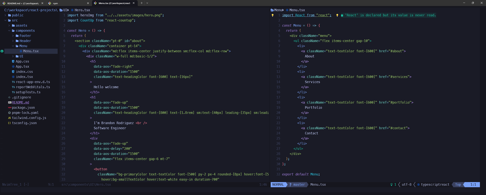

# Devbrod's nvim dotfiles



## Configs

- Neovim
- Lua

## ⚙ Requirements

- **Neovim:**

  - Neovim >= v0.8.1
  - [Nerd Fonts](https://www.nerdfonts.com/font-downloads)
  - NodeJS with npm
  - [Packer](https://github.com/wbthomason/packer.nvim) installed
  - [Git](https://git-scm.com/downloads)

- **Powershell**:
  - [Oh My Posh](https://ohmyposh.dev/docs/installation/windows)

## Neovim setup

### 📚 Project Structure

```
📂 ~/AppData/Local/nvim
├── 📂 lua/
│	      🌑 c-base.lua 
|       🌑 c-bookmark.lua
│	      🌑 c-cmp.lua 
|       🌑 c-line.lua
│	      🌑 c-lsp.lua 
|       🌑 c-lspkind.lua
│	      🌑 c-lspsaga.lua 
|       🌑 c-maps.lua
│	      🌑 c-mason.lua 
|       🌑 c-null.lua
│	      🌑 c-snip.lua 
|       🌑 c-style.lua
│	      🌑 c-telescope.lua 
|       🌑 c-text.lua
│	      🌑 c-theme.lua 
|       🌑 c-tree.lua
│	      🌑 c-treesitter.lua 
|       🌑 plugins.lua
└── 🌑 init.lua
```

### ✨ Features

- [devbrod92/c-base](https://github.com/devbrod92/nvim/blob/develop/lua/c-base.lua): A base setup for nvim.
- [https://github.com/MattesGroeger/vim-bookmarks](https://github.com/MattesGroeger/vim-bookmarks): Vim plugin allows toggling bookmarks per line.
- [hrsh7th/nvim-cmp](https://github.com/hrsh7th/nvim-cmp): A completion plugin for neovim coded in Lua.
- [hrsh7th/cmp-nvim-lsp:](https://github.com/hrsh7th/cmp-nvim-lsp) nvim-cmp source for neovim builtin LSP client
- [hrsh7th/cmp-path:](https://github.com/hrsh7th/cmp-path) nvim-cmp source for path
- [hrsh7th/cmp-buffer:](https://github.com/hrsh7th/cmp-buffer) nvim-cmp source for buffer words
- [nvim-lualine/lualine.nvim](https://github.com/nvim-lualine/lualine.nvim): A blazing fast and easy to configure neovim statusline plugin written in pure lua.
- [neovim/nvim-lspconfig](https://github.com/neovim/nvim-lspconfig): Quickstart configs for Nvim LSP
- [onsails/lspkind.nvim](https://github.com/onsails/lspkind.nvim): vscode-like pictograms for neovim lsp completion items.
- [wbthomason/packer](https://github.com/wbthomason/packer.nvim): A use-package inspired plugin manager for Neovim.
- [nvim-neo-tree/neo-tree](https://github.com/nvim-neo-tree/neo-tree.nvim): Neovim plugin to manage the file system and other tree like structures.
- [nvim-tree/nvim-web-devicons](https://github.com/nvim-tree/nvim-web-devicons): lua fork of vim-web-devicons for neovim.
- [rebelot/kanagawa](https://github.com/rebelot/kanagawa.nvim): NeoVim dark colorscheme inspired by the colors of the famous painting by Katsushika Hokusai.
- [nvim-treesitter/nvim-treesitter](https://github.com/nvim-treesitter/nvim-treesitter): Nvim Treesitter configurations and abstraction layer.
- [windwp/nvim-ts-autotag](https://github.com/windwp/nvim-ts-autotag): Use treesitter to auto close and auto rename html tag.
- [nvim-telescope/telescope.nvim](https://github.com/nvim-telescope/telescope.nvim): Highly extendable fuzzy finder over lists.
- [jose-elias-alvarez/null-ls.nvim](https://github.com/jose-elias-alvarez/null-ls.nvim): Use Neovim as a language server to inject LSP diagnostics, code actions, and more via Lua.
- [williamboman/mason.nvim](https://github.com/williamboman/mason.nvim): Portable package manager for Neovim that runs everywhere Neovim runs.
- [norcalli/nvim-colorizer.lua](https://github.com/norcalli/nvim-colorizer.lua): Color highlighter.
- [akinsho/toggleterm.nvim](https://github.com/akinsho/toggleterm.nvim): A neovim lua plugin to help easily manage multiple terminal windows.
- [lewis6991/gitsigns.nvim](https://github.com/lewis6991/gitsigns.nvim): Git integration for buffers.
- [iamcco/markdown-preview.nvim](https://github.com/iamcco/markdown-preview.nvim): Markdown preview plugin.
- [windwp/nvim-autopairs](https://github.com/windwp/nvim-autopairs): Autopairs for neovim written by lua.
- [xiyaowong/nvim-transparent](https://github.com/xiyaowong/nvim-transparent): Remove all background colors to make nvim transparent
- [L3MON4D3/LuaSnip](https://github.com/L3MON4D3/LuaSnip): Snippet Engine for Neovim written in Lua.
- [williamboman/mason-lspconfig.nvim:](https://github.com/williamboman/mason-lspconfig.nvim) Extension to mason.nvim that makes it easier to use lspconfig with mason.nvim.

### 🚀 Installation

Clone the repository.

```bash
git clone 
```

Move all content from `\nvim` to

- **Windows**: `$env:LOCALAPPDATA\nvim\`

- **Linux**: `~/.config/nvim`

and run the command:

```bash
nvim +PackerSync
```

or in Neovim Editor:

```bash
:PackerSync
```


